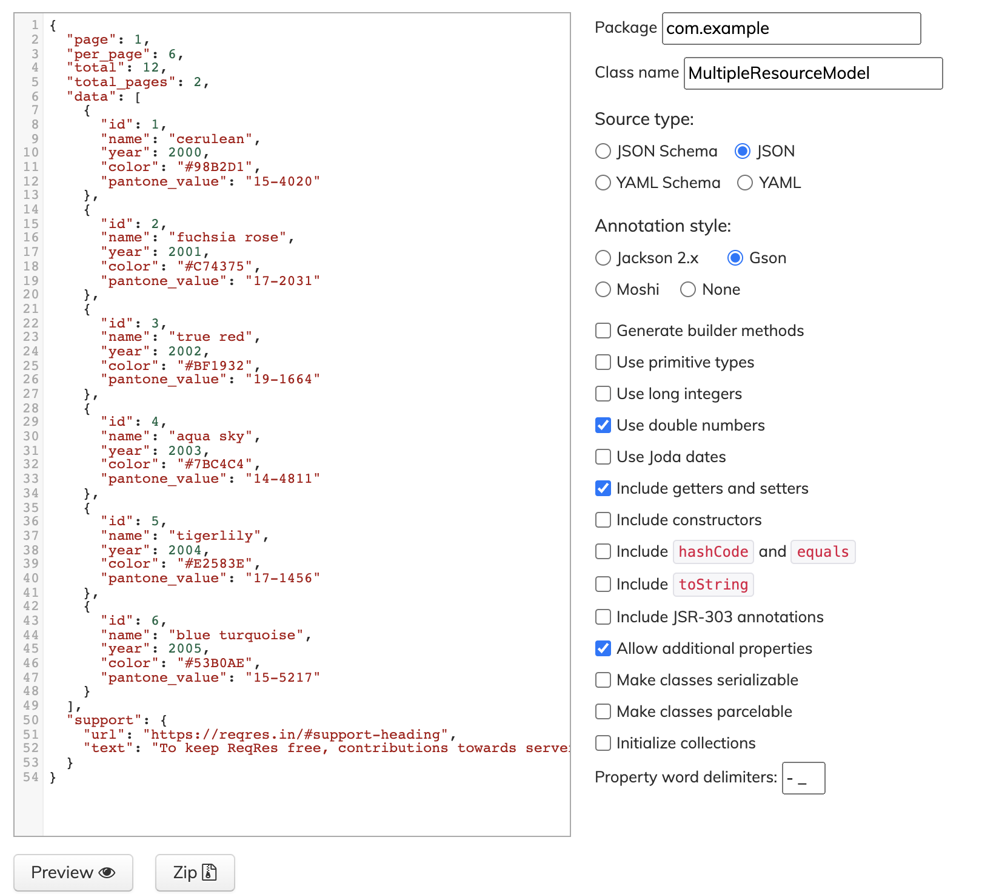
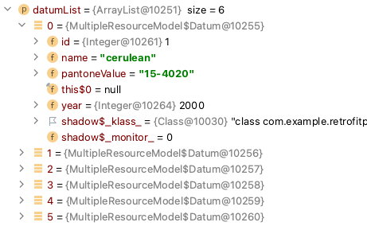
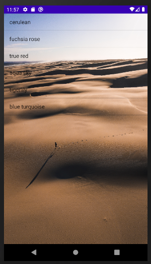

# Retrofit Android
Retrofit is type-safe REST client for Android and Java which aims to make it easier to consume RESTful web services. 

Retrofit 2 by default leverages OkHttp as the networking layer and is built on top of it.<dt>

Retrofit automatically serialises the JSON response using a POJO(Plain Old Java Object) which must be defined in advanced for the JSON Structure. To serialise JSON we need a converter to convert it into Gson first. We need to add the following dependencies in our build.grade file.<dt>

## API
We’ve used a few test APIs from [here](https://reqres.in/)<dt>

To create a POJO class for each response, we can go to https://www.jsonschema2pojo.org/ and paste the json response structure as shown in the image below.<dt>

 <dt>
Preview the POJO class and copy it into your Android Studio Project Structure.

### Response 

 <dt>

## Result 
 <dt>

## Source
https://square.github.io/retrofit/
https://www.journaldev.com/
